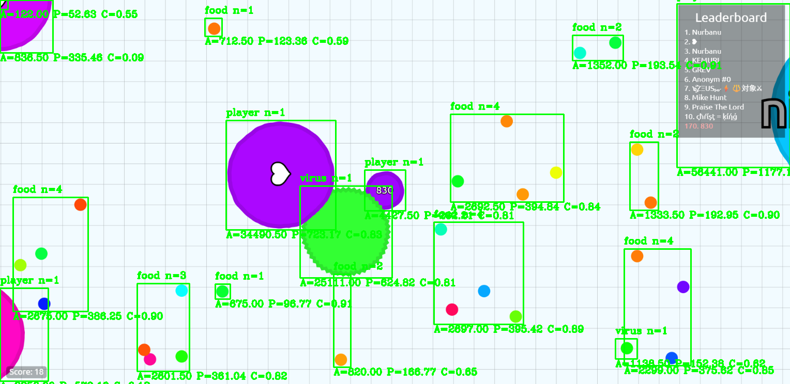
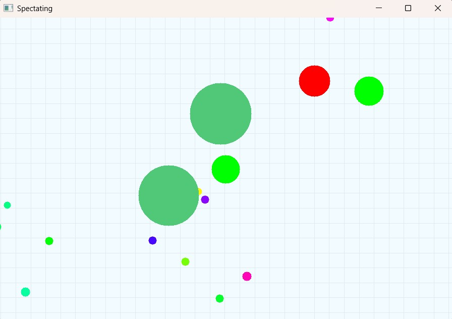

# Agario AI
This is a Python implementation of a genetic algorithm to train recurrent neural networks, and a model-based reflex agent to play [agar.io](https://en.wikipedia.org/wiki/Agar.io).

A clone of the game including all features is included in the repository which was used to train the RNNs. Web crawling is only used for demonstration of our agents against real human players.

## Stack
- Python3
- [PyGame](https://www.pygame.org/)
- [pygame-menu](https://github.com/ppizarror/pygame-menu)
- [socket](https://docs.python.org/3/library/socket.html)
- [loguru](https://github.com/Delgan/loguru)
- [torch](https://pytorch.org/)
- [numpy](https://numpy.org/)
- [tqdm](https://github.com/tqdm/tqdm)
- [selenium](https://www.selenium.dev/)
- [opencv-python](https://github.com/opencv/opencv-python)
- [pytesseract](https://github.com/madmaze/pytesseract)


## Setup
Clone the repository and change the working directory:

    git clone https://github.com/Viper4/Agario-AI.git
    cd AgarioAI
Create and activate the virtual environment:

    python3 -m venv ./venv
    source ./venv/bin/activate
Install requirements:

    pip3 install -r requirements.txt

## Usage

### Training RNN Agents
    python trainer.py

### Running Simulations
    # Run simulation with RNN, SRA, and MBRA agents
    python agario_simulation.py

### Single Player Game
    python agario_singleplayer.py

## Model-Based Reflex Agent with Memory Buffer

### Overview
The ModelBasedReflexAgent (MBRA) has been enhanced with a memory buffer system that implements priority-based decay for previously observed game objects. This allows the agent to make decisions based on both currently visible objects and remembered objects from recent observations.

### Memory Buffer Architecture

**MemoryItem Class:**
- Stores object information: type (threat/prey/food/virus), position, priority, timestamp
- Tracks object properties: area, radius, etc.

**MemoryBuffer Class:**
- Manages memory items grouped by type (threats, prey, foods, viruses)
- Supports add, update, decay, and cleanup operations
- Implements maximum capacity limits to prevent unbounded growth

### Priority Decay Mechanism

**Decay Formula:**
The priority of each memory item decays exponentially over time:
```
p_i(t) = p_i(0) * decay_factor ^ (t - t_0)
```

**Initial Priority Values:**
- Threats: 1.0 (highest priority)
- Prey: 0.8
- Foods: 0.6
- Viruses: 0.7

**Update Rules:**
- If object is currently visible: reset priority to initial value
- If object is not visible: apply exponential decay
- Remove objects when priority falls below threshold (0.1)

**Configuration Parameters:**
- `decay_factor`: 0.9-0.95 (decay rate per tick)
- `priority_threshold`: 0.1 (removal threshold)
- `max_memory_size`: 100 (max objects per type)

### Decision Integration

The agent combines current observations with memory buffer items:
1. **Current visible objects**: assigned initial priority values
2. **Memory buffer objects**: use decayed priority values
3. **Merging strategy**: 
   - If same object exists in both, use higher priority
   - Sort by priority, prioritize high-priority objects
   - Apply distance weighting for memory buffer objects

### Implementation Status

- Memory buffer data structures (MemoryItem, MemoryBuffer)
- Priority decay mechanism
- Integration with ModelBasedReflexAgent.get_action()
- run_mbra() method in agario_simulation.py for standalone MBRA testing
- Test script (test_mbra.py) for memory buffer and simulation testing

### Testing

Use the test script to verify memory buffer functionality and run MBRA simulations:

```bash
# Run all tests
python test_mbra.py

# Run only memory buffer tests
python test_mbra.py -t memory

# Run only simulation test
python test_mbra.py -t simulation

# Run simulation with custom parameters
python test_mbra.py -t simulation -d 120 -f 60 --headless
```

## Screenshots

Example of object recognition while web crawling on [agar.io](https://en.wikipedia.org/wiki/Agar.io)


Spectating a training simulation. Bright green cells are RNN agents and red cells are SRAs. Large dark green cells are viruses. Small multicolored pellets are food


## Acknowledgements

The agario clone game was modified from https://github.com/alexandr-gnrk/agario
