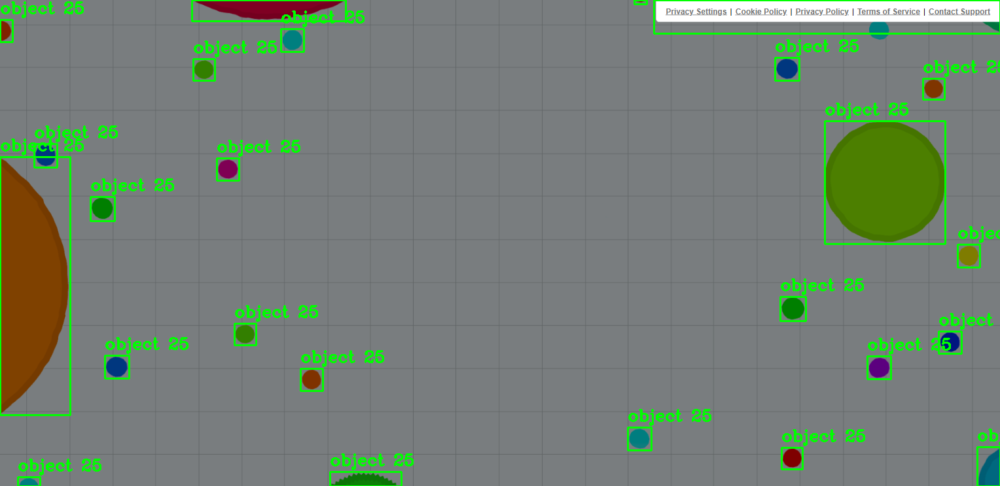

# Agar AI
This is a Python implementation of a genetic algorithm to train recurrent neural networks, and a model-based reflex agent to play [agar.io](https://en.wikipedia.org/wiki/Agar.io).

A clone of the game including all features is included in the repository which was used to train the RNNs. Web crawling is only used for demonstration of our agents against real human players.

## Stack
- Python3
- [PyGame](https://www.pygame.org/)
- [pygame-menu](https://github.com/ppizarror/pygame-menu)
- [socket](https://docs.python.org/3/library/socket.html)
- [loguru](https://github.com/Delgan/loguru)
- [torch](https://pytorch.org/)
- [numpy](https://numpy.org/)
- [tqdm](https://github.com/tqdm/tqdm)
- [selenium](https://www.selenium.dev/)
- [opencv-python](https://github.com/opencv/opencv-python)
- [pytesseract](https://github.com/madmaze/pytesseract)

## Setup
Clone the repository and change the working directory:

    git clone https://github.com/Viper4/Agario-AI.git
    cd AgarioAI
Create and activate the virtual environment:

    python3 -m venv ./venv
    source ./venv/bin/activate
Install requirements:

    pip3 install -r requirements.txt

## Usage

    usage: trainer.py
    usage: agario_simulation.py
    usage: agario_singleplayer.py

    Run 10 headless simulations with 5 MBRA and 5 RNN agents:
`python run_headless.py --mbras 5 --rnns 5 --num-runs 10 --output results.csv --headless`
Or use the PowerShell helper:
`.\run_experiments.ps1 -mbras 5 -rnns 5 -numRuns 10 -output results.csv`

## Screenshots

Example of object recognition while web crawling on [agar.io](https://en.wikipedia.org/wiki/Agar.io)

## Acknowledgements

The agario clone game was modified from https://github.com/alexandr-gnrk/agario
